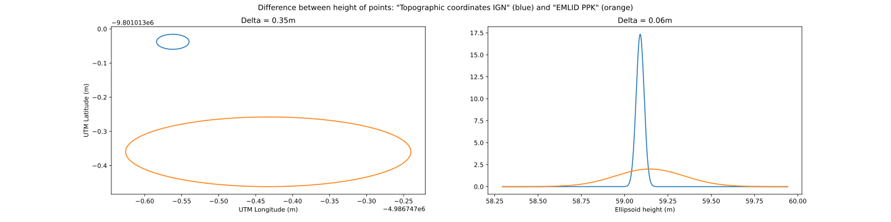
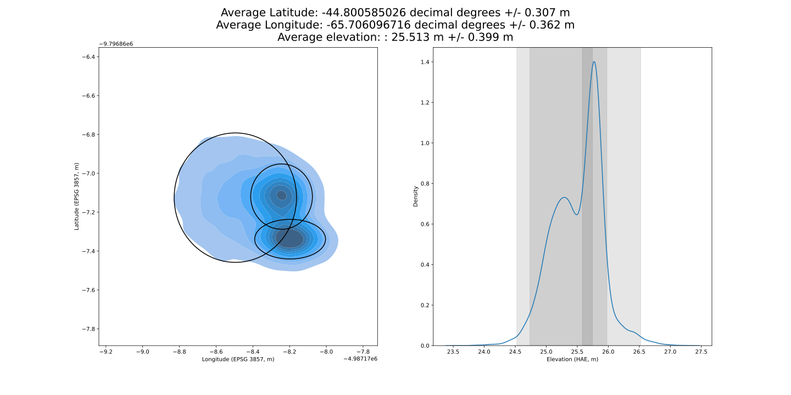

# GNSS processing scripts and utilities
This repository contains a series of jupyter notebooks to postprocess GPS data. Each notebook is oragnized within a folder, where also example files are stored.

# Comparison of two GNSS points within error ellipses
This script compares the distance of two GNSS points (Lat/Lon/Height Above Ellipsoid) within their uncertainties. 

## Single GNSS position from multiple points
This script usess a Monte-Carlo approach to calculate the average position (with positioning uncertainties) given a series of GNSS points collected at the same location. It can be used, for example, when several processing options are available for a base station point. The result is a single averaged position, with associated Lat/Lon/elevation 2-sigma uncertainties.

## PPK processing of "Stop and Go" data
This script can be used to process GNSS data acquired in "stop-and-go" mode. The script needs the following inputs:

 - Rover data processed with RTKlib as kinematic points and saved as *.pos* file
 - Files exported from the data collector in *.csv* format

The script first merges the data collector files into a single dataframe. Then, postprocessed rover data is imported and a new dataframe is created with time-averaged postprocessed static positions acquired in FIX status. Time-averaged positions are also calculated for FLOAT and SINGLE status datapoints. All the results are saved in a multi-sheet excel file.

For a guide on how to use the NRCAN system and RTKlib with EMLID GPS, see:
https://docs.emlid.com/reach/common/tutorials/ppp-introduction/

This discussion on the EMLID forum contains some useful insights on the processing, as well another (similar) tool, including an intuitive user interface. The results of this script compare well with those obtained from this tool.
https://community.emlid.com/t/ppk-point-extractor-software/12822/46

## RTK Processing of EMLID Reach RS+ GPS data

This script can be used to process data from GNSS receivers. One is a rover, the second is used as base station. At the time of data collection, the two receivers are connected through radio, working in RTK. Base station data are first acquired "on the fly" with a 10-minutes average single measurement, and then postprocessed using wither PPP or a PPK. To use the script, the following inputs are required:

 - Initial base station position
 - Corrected Lat,Lon,Height of base station
 - Files exported from the data collector in *.csv* format

The script first merges the data collector files into a single dataframe. Then, postprocessed rover data is imported and a new dataframe is created with time-averaged postprocessed static positions acquired in FIX status. Time-averaged positions are also calculated for FLOAT status datapoints. All the results are saved in a multi-sheet excel file.

A general outline of the survey workflow is explained here:

https://docs.emlid.com/reach/common/tutorials/placing-the-base/